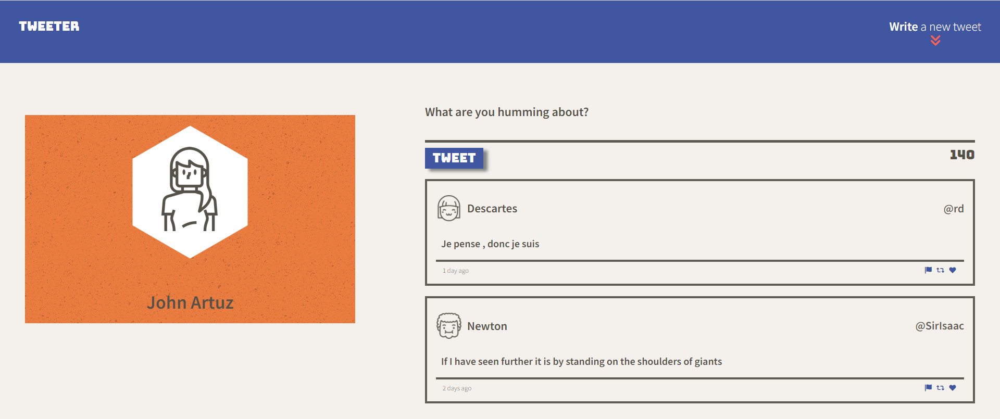
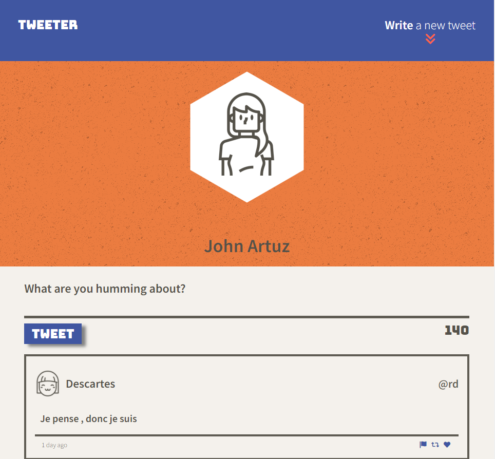

# Tweeter - A Front End Project

Tweeter is a simple, dynamic single-page Twitter clone. Utilizing the mobile-first design concept, responsive and user-friendly.

Tweeter is built using HTML, CSS, JS, jQuery and AJAX for the front-end, and Node, Express for the back-end.

## Final Product

 

## Getting Started

1. [Create](https://docs.github.com/en/repositories/creating-and-managing-repositories/creating-a-repository-from-a-template) a new repository using this repository as a template.
2. Clone your repository onto your local device.
3. Install dependencies using the `npm install` command.
4. Start the web server using the `npm run local` command. The app will be served at <http://localhost:8080/>.
5. Go to <http://localhost:8080/> in your browser.

## Dependencies

- Express
- Node 5.10.x or above
- body-parser
- chance
- md5
